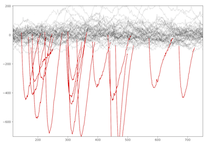
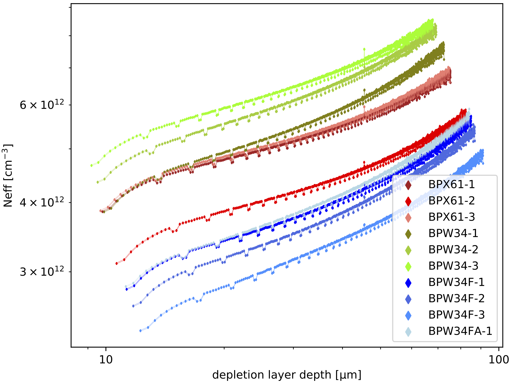

# DIY Particle Detector
A mobile low-cost spectrometer for measuring ionising radiation like alpha particles and electrons (energy range: 33 keV to 8 MeV).
It's an educational tool and citizen science device made for exploring natural and synthetic sources of radioactivity such as stones, airborne radon, potassium-rich salt or food and every-day objects (Uranium glass, old Radium watches etc.).

## Working Principle
Tiny amounts of electrical charge are generated in repurposed photodiodes by impinging particles. The charges form currents which are amplified and converted into voltage pulses that are compatible with audio/microphone signal inputs.
The size of the pulses is proportional to the energy deposited by the ionising radiation. A reference calibration with sources of known energy spectra is provided.

A superposition of several recorded pulse waveforms from electrons of beta decays (KCl salt sample, more info below):

Black lines in the upper area represent electronic noise, detected signal pulses from the natural radioactivity of potassium (isotope K-40) are highlighted in red.

*This repository contains all hardware design files, software sources and reference measurements accompanying the release of a scientific article on this work (add link later).*

## Hardware

The electronic design files are relased under the CERN OHL licence version 1.2.
### Versions
* [V1.1](https://github.com/ozel/DIY_particle_detector/tree/master/hardware/V1.1) is designed for four very low-cost BPW34 or BPW34F diodes (<<1 EUR each) and is sensitive to electrons from beta decays.
  [schematic drawing](https://github.com/ozel/DIY_particle_detector/blob/master/hardware/V1.1/DIY_detector.pdf),
  [parts overview](https://github.com/ozel/DIY_particle_detector/blob/master/hardware/V1.1/documentation/DIY_detector_parts_overview_V1-1.pdf),
  [build instructions](https://github.com/ozel/DIY_particle_detector/blob/master/hardware/V1.1/documentation/DIY_detector_instructions_V1-1.pdf)

  
* [V1.2](https://github.com/ozel/DIY_particle_detector/tree/master/hardware/V1.1) is designed for one BPX61 diode. 
  After its glass window is carefully broken and removed it can sense alpha particles and electrons (cut into the corners of the TO metal case with small pliers). 
  The circuit is most precise if only one BPX61 diode is attached (lowest electronic noise). 
  [schematic drawing of V1.2](https://github.com/ozel/DIY_particle_detector/blob/master/hardware/V1.2/DIY_detector_V1-2.pdf),
  build instructions of V1.1 apply in general besides some component values which are different (updated instructions will be added soon)
  
Since both kinds of diode have the same sensitive area (~7 mm^2) usage of circuit V1.1 is advised if detection of alpha particles is not desired but instead a higher countrate. 
Four diodes provide four times more sensitive volume and area which make the device more sensitive to sources of low intesity (low rate of radioactive decays).

Renderings of V1.2 showing the top side with one BPX61 diode on the left and the backside with a dual-stage operational amplifier circuit optimised to produce 1-2 ms long voltage pulses:

Mircoscope image of Osram BPX61 diode below, the green scale indicates 2 mm. The sensitive area of the silicon chip is 2.65 x 2.65 mm^2. A bond wire from the anode pin on the right connects the top of the chip (this side is also marked with a notch in the metal case, lower right corner). 
Care must be taken in order to keep the bond wire in place when the glass window gets removed.

### General Requirements

* An absolutely light-tight and electromagnetically shielded metal case is mandatory. Either a commercial one made of die casted aluminium (thick metal provides better immunity towards vibrations and prevents "microphonic effects") or an upcycled tin box for candies. 
  See pictures above and the schematics for corresponding part numbers of specific aluminium cases that fit.
* 9 V battery. NIMH-type accumulators with a nominal value of 9.6 V work best (mains-connected power supplies would introduce too much noise)
* Signal output is in the range of +/- 1 V and compatible with an audio/microphone input such as a headset connector of a mobile phone or laptop (or an oscilloscope if available)
* 
  For higher precision and better reproducability of measurements, a small USB soundcard (< 10 EUR) is recommended:
  The ICY-BOX IB-AC527 on the left and the K&ouml;nig Electronic CMP-SOUNDUSB12 on the right ("3D Sound Controller 5.1") use both a chip series from C-Media Electronics Inc: [CM108](https://www.cmedia.com.tw/products/USB20_FULL_SPEED/CM108AH).
  It's well specified with a flat frequency response in the required 1-5 kHz range and good signal to noise ratio. As standard USB Audio Class devices, no dirvers are required and they are recognised as regular audio input device in many operating systems, including Android & iOS.
* Several reference measurements are provided in [data_analysis_and_reference_measurements/diode_detector/data](https://github.com/ozel/DIY_particle_detector/tree/master/data_analysis_and_reference_measurements/diode_detector/data). 
  All have been recorded using the blue CM108 USB soundcard from König, sampling the input signal (yellow connector) @ 48 kHz and 16 bit resolution.
* The connection cable should use a 3-pin 3.5 mm mini-jack connector since these sound interfaces supply a bias voltage on the ring/center tap of the microphone input which must be circumvented/avoided. 
  For further details please refer to the schematics.

### DIY Detector Building Workshops

The detectors have been built by high school students (age 16 - 18) and citizen science enthusiasts (age ~20 - 60) during several workshops.
After a little introduction into the soldering of electronic components, the whole device can be built in less than two hours - including the modification of a candy tin box as its case.

* [S'Cool LAB Summer Camp 2017](https://indico.cern.ch/event/570855/timetable/) at CERN, [poster presentation](https://indico.cern.ch/event/570855/contributions/2616929/attachments/1504724/2344411/RG3_DIY_Detector.pdf)
* [Student Summer School of Barcelona Technoweek 2017](http://icc.ub.edu/congress/TechnoWeek2018/outreach_EN.php), [CERN news](https://home.cern/news/news/knowledge-sharing/summer-school-secondary-students-spain)
* [S'Cool LAB Summer Camp 2018](https://indico.cern.ch/event/726779/timetable/) at CERN, [poster presentation, page 3](https://indico.cern.ch/event/726779/contributions/2991390/attachments/1697186/2732121/pdfjoiner.pdf)
* [Gathering of Open Science Hardware 2018 in Shenzhen China](http://openhardware.science/gatherings/gosh-2018-2/), [workshop documentation](https://forum.openhardware.science/t/day-3-build-your-own-particle-detector-discover-natural-radioactivity/1468)

## Software
The software in this repository is provided under the open source BSD Licence.

It consists of two parts:
* Measurement recording, real-time display and counting of particle pulses
* Data analysis of recorded measurements, providing calibrated energy spectra and time series histograms

### Recording Software
Two kinds of software for recording the voltage pulses are developed:
* A [web browser application](https://ozel.github.io/DIY_particle_detector/data_recording_software/webGui/) based on the Web Audio API of modern browsers (recent Chrome and Firefox versions work best), compatible with mobile/smartphone and desktop operating systems.
  For further notes on its implementation and usage please refer to [pulse_recorder.js](https://github.com/ozel/DIY_particle_detector/blob/master/data_recording_software/webGui/js/pulse_recorder.js). 

  
* A [python script](https://github.com/ozel/DIY_particle_detector/blob/master/data_recording_software/pulse_recorder.py). Ideal for longer measurements, e.g. over night. The reference measurements listed below have been taken with this software.

### Data Analysis

The recorded pulse data is saved in files (using Python's Pickle or the MessagePack format) by the software listed above and opened for further analysis by [analyse_and_plot_pulses.py](https://github.com/ozel/DIY_particle_detector/blob/master/data_analysis_and_reference_measurements/diode_detector/analyse_and_plot_pulses.py).
This python script converts the measurement data into time series histograms and calibrated energy spectra.

## Reference measurements and plots

Several reference measurements have been taken and stored in [data_analysis_and_reference_measurements/diode_detector/data](https://github.com/ozel/DIY_particle_detector/tree/master/data_analysis_and_reference_measurements/diode_detector/data).
If this whole respository is cloned using git, the [git GLS](https://help.github.com/en/articles/duplicating-a-repository#mirroring-a-repository-that-contains-git-large-file-storage-objects) extension must be used to get as well the large data files (~ 1 GB).
The data files can be downloaded alternatively from this Zenodo archive: .

Overview on reference measurements:

* A mixed alpha source featuring Gd-148, Pu-239, Am-241 & Cm-244 with a combined alpha energy spectrum of 3 to 6 MeV
* 10 g of KCl (potassium chlorid) salt (an alternative to NaCl table salt) as an example for detection of electrons from beta-decays (from naturally occuring K-40)
* a small columbite stone (containing trace amounts of uranium ore), a combined source of electrons and alphas (and gamma photons which do not interact enough within the thin diode detector to be relevant)
* a watch hand from an old watch that was painted with luminescent radium paint. Featuring Ra-226 and all it's radioactive progeny isotopes

## Pixel Detector

For comparsion, two measurements have been made with the [iPadPix](https://github.com/ozel/iPadPix) mobile device that is based on the 1.4 x 1.4 cm^2 hybrid pixel detector Timepix. It's silicon sensor chip area is 28 times larger and the sensitive volume is about 6 times bigger (300 um vs. 50 um) than a single BPW34 or BPX61 diode.
Due to it's larger area, it is well suited for measuring less concentrated sources of radioactivity such as airborne radon progeny collected with an electrostatically charged party balloon.
The diode-based detector can be regarded as a functional model for one pixel of pixel detectors. The physics behind signal formation and subsequent signal processing methods which amplify, characterise and digitise the pulses are the same.
For further details please consult the scripts provided in [data_analysis_and_reference_measurements/pixel_detector](https://github.com/ozel/DIY_particle_detector/tree/master/data_analysis_and_reference_measurements/pixel_detector) and refer to the corresponding article.

## Diode Characterisation

C-V curves of several diodes of the BPW34 series and BXP61 type have been taken to characterise the thickness of the sensitive layer under reverse bias conditions.
With about 8 V on the cathode (as it is the case in the circuits V1.1 and V1.2), the typical sensitive layer thickness is about 50 um which corresponds well with the recorded energy spectra. 
Based on the CV curves, the following doping profiles are derived:

The effective charge carrier concentration 'Neff' is on average about half of the value reported in 2008 by [Ravotti et al.](http://cds.cern.ch/record/1169276/files/04636908.pdf) which can be explained by manufacturing process variations. The similarity of the curve shapes confirms that the investigated diodes use either the same or at least very similar silicon chips. The regular micropattern visible in the doping profile curves is a measurement artefact which is caused by rounding errors of the CV measurement device. The thin double lines indicate the error range of the instrument as reported by the manufacturer (Keysight B1500A with the MFCMU module). 

Further discussion of the CV measurements can be found in the paper.
The folder [data_analysis_and_reference_measurements/diode_detector/diode_characterisation_and_simulation_plots](https://github.com/ozel/DIY_particle_detector/tree/master/data_analysis_and_reference_measurements/diode_detector/diode_characterisation_and_simulation_plots) provides the scripts to reproduce the corresponding plots.
The raw C-V measurement data is available in [data_analysis_and_reference_measurements/diode_detector/data/high_resolution_CV](https://github.com/ozel/DIY_particle_detector/tree/master/data_analysis_and_reference_measurements/diode_detector/data/high_resolution_CV).

